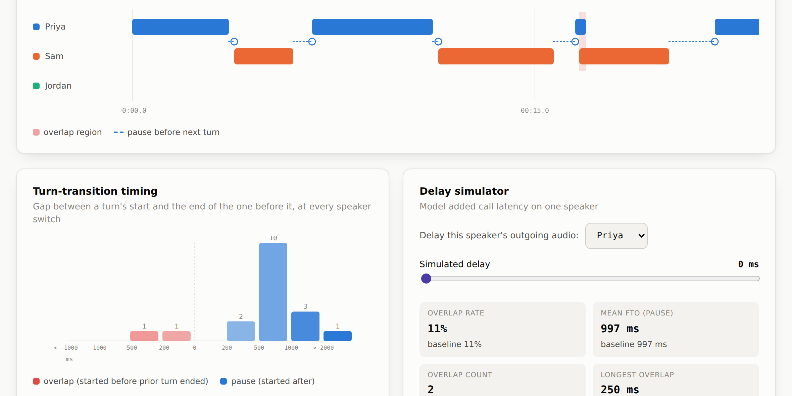

# Turn Lag

A small browser-based instrument for looking at the timing of a conversation: who talks when, how long the gaps between turns run, where turns overlap, and — the interesting part — what happens to all of that once you simulate a bit of call latency on one speaker.

Paste in a transcript, and Turn Lag gives you a timeline, a distribution of turn-transition gaps, per-speaker stats, and a delay simulator that recomputes everything as if one participant's audio were arriving late.



**[Live demo →](#deploying)** (see below for a one-click way to host your own)

## Why

Conversation researchers measure the timing of turn-taking with something called the **floor-transfer offset (FTO)**: the gap between when one person's turn ends and the next person's turn starts. In face-to-face conversation this gap clusters tightly around ~200ms — famously faster than the time it takes to plan an utterance from scratch, which is part of why turn-taking timing is such a well-studied phenomenon in psycholinguistics.

Video calls complicate this. Audio latency delays what each person hears, which can shift turn-transition timing in ways that get misread as social signals — a slow response reads as disengagement, a fast one reads as an interruption, even though nobody actually changed how they were listening or responding. That's the mechanism the delay simulator here is modeling: shift one speaker's timing by a fixed delay and watch the overlap rate and pause lengths move, with nobody in the conversation doing anything differently.

Turn Lag isn't a research tool for publication-grade analysis — it's a quick, visual way to explore that idea on a real transcript, whether that's an actual call recording or something you're using to sanity-check the concept.

## Using it

Open `index.html` in any browser. Everything runs client-side; nothing you paste is sent anywhere.

1. Paste a transcript (or click **Load sample conversation** to try it with a synthetic example), or upload a `.vtt`/`.srt`/`.csv` file.
2. Click **Analyze transcript**.
3. Explore the timeline, the turn-transition histogram, the per-speaker breakdown, and the sortable turn table.
4. In the **delay simulator**, pick a speaker and drag the slider to see how added latency shifts overlap rate and pause length.

### Supported formats

**WebVTT** and **SRT** — the standard export from Zoom, Otter, most captioning tools, and most speaker-diarization pipelines (e.g. `pyannote` / Whisper-based tools tend to emit SRT with a `[SPEAKER_00]:`-style tag). The two formats are parsed the same way; the only real differences are the header line and the timestamp's decimal mark (`.` for VTT, `,` for SRT), both handled automatically. Speaker can be tagged as `<v Name>`, `[Name]:`, or plain `Name:` at the start of the cue:

```vtt
WEBVTT

1
00:00:00.000 --> 00:00:02.500
Alice: Hey, how's it going?

2
00:00:02.300 --> 00:00:04.100
Bob: Pretty good, you?
```

```srt
1
00:00:03,254 --> 00:00:04,175
[SPEAKER_01]: What's your favorite movie?

2
00:00:06,299 --> 00:00:11,667
[SPEAKER_00]: I have a pretty bad memory.
```

**CSV** — columns `speaker, start, end, text` (text is optional). Times can be given in seconds or as `mm:ss` / `hh:mm:ss.mmm`:

```csv
speaker,start,end,text
Alice,0:00,0:02.5,"Hey, how's it going?"
Bob,0:02.3,0:04.1,Pretty good
```

Three example files are in [`sample-data/`](sample-data) — one per format — if you want to see them end to end.

Cues from the same speaker within a configurable window (300ms by default) get merged into a single turn before anything is computed — this keeps a transcript that logs every individual utterance from being counted as dozens of tiny turns.

Some transcription and diarization tools do the opposite in one specific case: a run of short, rapid-fire answers (e.g. a series of "True"/"False" judgments given back-to-back with barely a pause) gets bundled into a single long cue instead of one per answer. If that's showing up in your transcript, list those words in **"Split a turn that's just a run of these words back into one turn each"** (e.g. `true, false`) — any turn whose *entire* text is nothing but those words, in any order, gets split evenly back into one turn per word. Turns with other content mixed in are left alone.

### Two separate speaker tracks

If you've got two separate recordings of the same call — one per person, as you'd get from two local recordings, or two separately-transcribed audio tracks — use the **Two speaker tracks** tab instead of combining them yourself. Upload one file per speaker, give each a name, and Turn Lag merges them into a single timeline and runs the same analysis on the combined result. Any speaker tags already inside those files are ignored; every cue in a track file is stamped with the name you gave that track, so a plain, untagged transcript works fine as a track file.

This only works if both files' timestamps share the same zero point — i.e. both are counted from the same moment the call or recording started. If one track has, say, ten seconds of dead air at the start that the other doesn't, the timing analysis (especially overlap detection) will be off by that amount.

## How the numbers are computed

- **Turn-transition timing** follows standard FTO methodology: for every turn after the first, the gap is measured against the turn immediately before it. A speaker switch produces an FTO (positive = pause, negative = overlap); a same-speaker adjacency is counted separately as a "self-continuation" pause and left out of the FTO statistics.
- **Overlap rate** is the share of speaker-switch transitions where the next turn began before the previous one ended.
- **The delay simulator** shifts every turn from the selected speaker forward by the chosen number of milliseconds, then recomputes turn-transition timing from scratch on that adjusted transcript — modeling their audio arriving later to their conversational partner.

## Deploying

To host your own copy on GitHub Pages: push this repo, then in **Settings → Pages** set the source to the `main` branch, root folder. That's it — `index.html` is the entry point.

## License

MIT — see [LICENSE](LICENSE).
